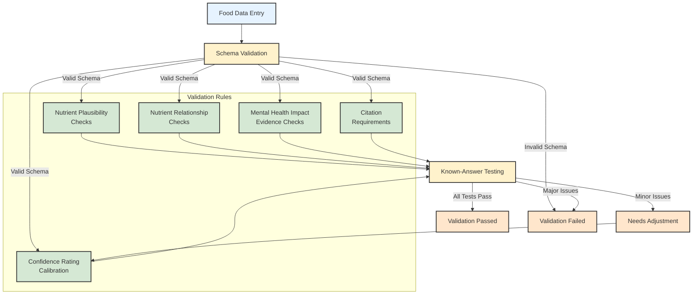

# Nutritional Psychiatry Dataset

A comprehensive open-source dataset connecting food nutrients to mental health impacts, designed to bridge the gap between nutrition science and mental wellness applications.

## Overview

This project aims to create the first comprehensive, open-source dataset that connects food composition to mental health impacts based on nutritional psychiatry research. By enhancing standard food data with brain-specific nutrients and evidence-based mental health relationships, we're building a foundation for research and applications at the intersection of nutrition and mental wellness.

[Data Collection & Processing Methodology](/docs/methodology.md)
[AI Methodology](/docs/ai-methodology.md)
[Data Dictionary](/docs/data-dictionary.md)
[Literature Review Methodology](/docs/literature-review.md)

### The Problem

Current food databases like USDA FoodData Central provide excellent general nutritional information but lack:
1. Complete data on brain-specific nutrients (omega-3s, tryptophan, etc.)
2. Information about bioactive compounds relevant to brain health
3. Evidence-based connections to mental health impacts
4. Confidence ratings to communicate data quality

### Our Approach

We're building a dataset that:
- Starts with trusted USDA data as a foundation
- Enriches it with brain-specific nutrients often missing from standard databases
- Adds research-backed mood impact relationships with confidence ratings
- Includes comprehensive metadata for transparency and quality tracking

## Dataset Schema

The dataset follows a comprehensive schema that includes:

### Basic Food Information
- Unique identifier
- Name and description
- Food category
- Serving size information

### Standard Nutrients
- Macronutrients (protein, carbs, fat)
- Vitamins
- Minerals
- Fiber
- Sugars

### Brain-Specific Nutrients
- Omega-3 fatty acids (EPA, DHA, ALA)
- Tryptophan (serotonin precursor)
- Tyrosine (dopamine precursor)
- B vitamins (B6, B9/folate, B12)
- Vitamin D
- Magnesium, zinc, iron, selenium
- Choline

### Bioactive Compounds
- Polyphenols
- Flavonoids
- Anthocyanins
- Carotenoids
- Prebiotic fiber
- Probiotic content

### Mental Health Impacts
- Impact type (mood, anxiety, cognition, etc.)
- Direction of effect (positive, negative, neutral)
- Mechanism of action
- Strength of effect (1-10 scale)
- Confidence rating based on research evidence
- Time to effect (acute vs. cumulative)
- Research citations

### Data Quality Metrics
- Completeness scores
- Overall confidence rating
- Source tracking (measured, literature-derived, AI-generated)

## Project Structure

Please see [project-structure.md](/project-structure.md)

## Data Sources

The dataset is built from multiple sources:

1. **USDA FoodData Central**: Provides the foundation of standard nutrient data
2. **Published Research Literature**: Source for specific brain-nutrient connections and mental health impacts
3. **AI-Assisted Generation**: For filling gaps in data where direct measurements aren't available
4. **Expert Validation**: For quality control and confidence rating

All data includes source tracking and confidence ratings.

## Current Status

This project is in the early development phase. We are currently:

1. Developing the data collection pipeline
2. Defining comprehensive schemas
3. Building the initial proof of concept with 25-50 foods
4. Creating AI-assisted enrichment processes

## Getting Started

### Prerequisites

- Python 3.8+
- Required packages: `pip install -r requirements.txt`
- USDA FoodData Central API key (free from [data.gov](https://api.data.gov/signup/))
- OpenAI API key (for AI-assisted enrichment)

### Installation

```bash
# Clone the repository
git clone https://github.com/yourusername/nutritional-psychiatry-dataset.git
cd nutritional-psychiatry-dataset

# Install dependencies
pip install -r requirements.txt

# Set environment variables
export USDA_API_KEY=your_api_key
export OPENAI_API_KEY=your_openai_key  # Only needed for AI enrichment
```

### Usage

#### Collecting USDA Data

```bash
python scripts/data_collection/usda-api.py
```

#### Transforming to Our Schema

```bash
python scripts/data_processing/transform.py
```

#### Enriching with AI

```bash
python scripts/data_processing/enrichment.py --limit 5  # Process 5 foods
```

## Roadmap

1. **Phase 1: Data Collection & Foundation** (Current)
   - Establish USDA data as base
   - Define schema for brain-specific nutrients
   - Create data pipeline structure

2. **Phase 2: AI-Assisted Enrichment**
   - Use GPT-4 or similar models to generate missing nutrient data
   - Extract relationships from nutritional psychiatry literature
   - Implement confidence scoring system

3. **Phase 3: Quality Control**
   - Create validation interfaces
   - Document data sources and generation methods
   - Prepare for expert review

4. **Phase 4: Public Release & Expansion**
   - Release V1.0 dataset
   - Expand coverage to more foods
   - Incorporate community contributions

## Contributing

Contributions are welcome! See [CONTRIBUTING.md](CONTRIBUTING.md) for details.

We especially welcome:
- Nutritional scientists
- Mental health professionals
- Data scientists
- Developers building nutrition and wellness applications

## Scientific Validation



This dataset is being developed with scientific rigor in mind:

- All AI-generated data is clearly marked and confidence-scored
- Literature-based connections include citations to research
- Transparent methodology for all data generation
- Planned expert validation phase

## License

This project is licensed under the MIT License - see the [LICENSE](LICENSE) file for details.

## Acknowledgments

- USDA FoodData Central for the foundation nutritional data
- Researchers advancing the field of nutritional psychiatry
- Contributors and advisors to this project

## Contact

- GitHub Issues: For bug reports and feature requests

---

**Note:** This dataset is intended for research and educational purposes. It should not be used as the sole basis for medical decisions. Always consult healthcare professionals for medical advice.