# Nutritional Psychiatry Database: Data Dictionary

This document provides detailed descriptions of all fields in the Nutritional Psychiatry Database schema. It serves as a reference for understanding the data structure, field meanings, units of measurement, and data types within the PostgreSQL database.

## Database Schema

The core database schema consists of three main tables:

| Table | Description |
|-------|-------------|
| `foods` | Primary table storing food data as JSONB |
| `food_evaluations` | Stores evaluation results for foods |
| `evaluation_metrics` | Stores metrics from evaluation runs |

### Foods Table

```sql
CREATE TABLE foods (
  food_id TEXT PRIMARY KEY,
  name TEXT NOT NULL,
  source TEXT NOT NULL,
  category TEXT,
  processed BOOLEAN DEFAULT FALSE,
  validated BOOLEAN DEFAULT FALSE,
  validation_errors JSONB,
  food_data JSONB NOT NULL,
  created_at TIMESTAMP WITH TIME ZONE DEFAULT NOW(),
  last_updated TIMESTAMP WITH TIME ZONE DEFAULT NOW()
);
```

The `food_data` JSONB column contains the complete food data structure as defined below.

## Schema Diagram

```mermaid
classDiagram
    class FoodData {
        +String food_id
        +String name
        +String description
        +String category
        +ServingInfo serving_info
        +StandardNutrients standard_nutrients
        +BrainNutrients brain_nutrients
        +BioactiveCompounds bioactive_compounds
        +List~MentalHealthImpact~ mental_health_impacts
        +List~NutrientInteraction~ nutrient_interactions
        +ContextualFactors contextual_factors
        +InflammatoryIndex inflammatory_index
        +List~NeuralTarget~ neural_targets
        +List~PopulationVariation~ population_variations
        +List~DietaryPattern~ dietary_patterns
        +DataQuality data_quality
        +Metadata metadata
        +Boolean processed
        +Boolean validated
        +List~String~ validation_errors
    }
    
    class ServingInfo {
        +Number serving_size
        +String serving_unit
        +String household_serving
    }
    
    class StandardNutrients {
        +Number calories
        +Number protein_g
        +Number carbohydrates_g
        +Number fat_g
        +Number fiber_g
        +Number sugars_g
        ...
    }
    
    class BrainNutrients {
        +Number tryptophan_mg
        +Number tyrosine_mg
        +Number vitamin_b6_mg
        +Number folate_mcg
        +Number vitamin_b12_mcg
        +Number vitamin_d_mcg
        +Number magnesium_mg
        +Number zinc_mg
        +Number iron_mg
        +Number selenium_mcg
        +Number choline_mg
        +Omega3 omega3
    }
    
    class Omega3 {
        +Number total_g
        +Number epa_mg
        +Number dha_mg
        +Number ala_mg
        +Number confidence
    }
    
    class BioactiveCompounds {
        +Number polyphenols_mg
        +Number flavonoids_mg
        +Number anthocyanins_mg
        +Number carotenoids_mg
        +Number probiotics_cfu
        +Number prebiotic_fiber_g
    }
    
    class MentalHealthImpact {
        +String impact_type
        +String direction
        +String mechanism
        +Number strength
        +Number confidence
        +String time_to_effect
        +String research_context
        +List~ResearchSupport~ research_support
    }
    
    class NutrientInteraction {
        +String interaction_id
        +List~String~ nutrients_involved
        +String interaction_type
        +String mechanism
        +Number confidence
        +String pathway
        +String mental_health_relevance
        +List~ResearchSupport~ research_support
        +List~String~ foods_demonstrating
    }
    
    class ContextualFactors {
        +CircadianEffects circadian_effects
        +List~FoodCombination~ food_combinations
        +List~PreparationEffect~ preparation_effects
    }
    
    class DataQuality {
        +Number completeness
        +Number overall_confidence
        +String brain_nutrients_source
        +String impacts_source
        +SourcePriority source_priority
    }
    
    class SourcePriority {
        +String standard_nutrients
        +String brain_nutrients
        +String bioactive_compounds
    }
    
    class Metadata {
        +String version
        +DateTime created
        +DateTime last_updated
        +List~String~ source_urls
        +Dict~String,String~ source_ids
        +String image_url
        +List~String~ tags
    }
    
    class NeuralTarget {
        +String pathway
        +String effect
        +Number confidence
        +List~String~ mechanisms
        +String mental_health_relevance
    }
    
    class DietaryPattern {
        +String pattern_name
        +String pattern_contribution
        +String mental_health_relevance
    }

    class PopulationVariation {
        +String population
        +String description
        +List~NutrientVariation~ variations
    }
    
    class InflammatoryIndex {
        +Number value
        +Number confidence
        +String calculation_method
        +List~String~ citations
    }
    
    FoodData *-- ServingInfo
    FoodData *-- StandardNutrients
    FoodData *-- BrainNutrients
    FoodData *-- BioactiveCompounds
    FoodData *-- MentalHealthImpact
    FoodData *-- NutrientInteraction
    FoodData *-- ContextualFactors
    FoodData *-- DataQuality
    FoodData *-- Metadata
    FoodData *-- NeuralTarget
    FoodData *-- DietaryPattern
    FoodData *-- PopulationVariation
    FoodData *-- InflammatoryIndex
    BrainNutrients *-- Omega3
    DataQuality *-- SourcePriority
```



## Basic Food Information

| Field | Description | Type | Example | Notes |
|-------|-------------|------|---------|-------|
| `food_id` | Unique identifier | String | "usda_173950" | Prefixed with source type (e.g., 'usda_') |
| `name` | Common food name | String | "Blueberries, raw" | Standardized naming convention |
| `description` | Detailed description | String | "Raw blueberries (Vaccinium spp.), edible fruit portions" | May include taxonomic information |
| `category` | Food group/category | String | "Fruits" | Simplified category system |
| `processed` | Processing flag | Boolean | true | Indicates data transformation |
| `validated` | Validation flag | Boolean | true | Indicates schema validation |
| `validation_errors` | List of errors | Array | ["Missing required field"] | Only present if validation failed |

## Serving Information

| Field | Description | Type | Example | Notes |
|-------|-------------|------|---------|-------|
| `serving_info.serving_size` | Standard serving size | Number | 100 | Typically per 100g for comparison |
| `serving_info.serving_unit` | Unit of measurement | String | "g" | Usually grams |
| `serving_info.household_serving` | Common household measure | String | "1 cup (148g)" | For practical use |

## Standard Nutrients

All values per 100g of food unless otherwise specified.

| Field | Description | Type | Unit | Notes |
|-------|-------------|------|------|-------|
| `standard_nutrients.calories` | Energy content | Number | kcal | Total caloric content |
| `standard_nutrients.protein_g` | Protein content | Number | g | Total protein |
| `standard_nutrients.carbohydrates_g` | Carbohydrate content | Number | g | Total carbohydrates |
| `standard_nutrients.fat_g` | Fat content | Number | g | Total fat |
| `standard_nutrients.fiber_g` | Dietary fiber | Number | g | Total fiber |
| `standard_nutrients.sugars_g` | Total sugars | Number | g | All sugars (natural + added) |
| `standard_nutrients.sugars_added_g` | Added sugars | Number | g | Sugars added during processing |
| `standard_nutrients.calcium_mg` | Calcium | Number | mg | |
| `standard_nutrients.iron_mg` | Iron | Number | mg | |
| `standard_nutrients.magnesium_mg` | Magnesium | Number | mg | |
| `standard_nutrients.phosphorus_mg` | Phosphorus | Number | mg | |
| `standard_nutrients.potassium_mg` | Potassium | Number | mg | |
| `standard_nutrients.sodium_mg` | Sodium | Number | mg | |
| `standard_nutrients.zinc_mg` | Zinc | Number | mg | |
| `standard_nutrients.copper_mg` | Copper | Number | mg | |
| `standard_nutrients.manganese_mg` | Manganese | Number | mg | |
| `standard_nutrients.selenium_mcg` | Selenium | Number | mcg | |
| `standard_nutrients.vitamin_c_mg` | Vitamin C | Number | mg | |
| `standard_nutrients.vitamin_a_iu` | Vitamin A | Number | IU | International Units |

## Nutrient Interactions

Interactions between nutrients affecting mental health outcomes.

| Field | Description | Type | Notes |
|-------|-------------|------|-------|
| `nutrient_interactions[].interaction_id` | Unique identifier | String | e.g., "int_001" |
| `nutrient_interactions[].nutrients_involved` | List of interacting nutrients | Array | References to nutrient fields |
| `nutrient_interactions[].interaction_type` | Type of interaction | String | synergistic, antagonistic, required_cofactor, protective, inhibitory |
| `nutrient_interactions[].pathway` | Biochemical pathway affected | String | e.g., "serotonin_synthesis" |
| `nutrient_interactions[].mechanism` | Mechanism of action | String | Detailed explanation of interaction |
| `nutrient_interactions[].mental_health_relevance` | Relevance to mental health | String | How this interaction affects mental function |
| `nutrient_interactions[].confidence` | Confidence rating | Number | 1-10 scale |
| `nutrient_interactions[].research_support` | Supporting research | Array | Citations for interaction |
| `nutrient_interactions[].foods_demonstrating` | Foods showing this interaction | Array | Food IDs demonstrating interaction |

## Contextual Factors

Factors that affect how nutrients impact mental health based on context.

### Circadian Effects

| Field | Description | Type | Notes |
|-------|-------------|------|-------|
| `contextual_factors.circadian_effects.description` | General description | String | Overview of time effects |
| `contextual_factors.circadian_effects.factors[].factor` | Specific timing factor | String | e.g., "morning_consumption" |
| `contextual_factors.circadian_effects.factors[].effects` | Effects of this timing | Array | List of effects |
| `contextual_factors.circadian_effects.factors[].relevant_to` | Affected nutrients | Array | Nutrients affected by timing |
| `contextual_factors.circadian_effects.factors[].confidence` | Confidence rating | Number | 1-10 scale |
| `contextual_factors.circadian_effects.factors[].citations` | Supporting research | Array | Citations |

### Food Combinations

| Field | Description | Type | Notes |
|-------|-------------|------|-------|
| `contextual_factors.food_combinations[].combination` | Combination type | String | e.g., "with_fat" |
| `contextual_factors.food_combinations[].effects` | Effects of combination | Array | List of effects |
| `contextual_factors.food_combinations[].relevant_to` | Affected nutrients | Array | Nutrients affected |
| `contextual_factors.food_combinations[].confidence` | Confidence rating | Number | 1-10 scale |

### Preparation Effects

| Field | Description | Type | Notes |
|-------|-------------|------|-------|
| `contextual_factors.preparation_effects[].method` | Preparation method | String | e.g., "fermentation" |
| `contextual_factors.preparation_effects[].effects` | Effects of method | Array | List of effects |
| `contextual_factors.preparation_effects[].relevant_to` | Affected nutrients | Array | Nutrients affected |
| `contextual_factors.preparation_effects[].confidence` | Confidence rating | Number | 1-10 scale |

## Population Variations

Differences in response across different populations.

| Field | Description | Type | Notes |
|-------|-------------|------|-------|
| `population_variations[].population` | Target population | String | e.g., "older_adults" |
| `population_variations[].description` | Population description | String | Details about the population |
| `population_variations[].variations[].nutrient` | Affected nutrient | String | Nutrient field name |
| `population_variations[].variations[].effect` | Effect type | String | e.g., "reduced_absorption" |
| `population_variations[].variations[].mechanism` | Mechanism of variation | String | How the variation occurs |
| `population_variations[].variations[].impact_modifier` | Effect modifier | Number | Multiplier for effect strength |
| `population_variations[].variations[].recommendations` | Recommendations | Array | Advice for this population |
| `population_variations[].variations[].confidence` | Confidence rating | Number | 1-10 scale |
| `population_variations[].variations[].citations` | Supporting research | Array | Citations |

## Dietary Patterns

Information on whole dietary patterns this food contributes to.

| Field | Description | Type | Notes |
|-------|-------------|------|-------|
| `dietary_patterns[].pattern_name` | Name of dietary pattern | String | mediterranean, western, dash, mind, etc. |
| `dietary_patterns[].pattern_contribution` | Food's role in pattern | String | key_component, supportive, occasional, limited, avoided |
| `dietary_patterns[].mental_health_relevance` | Mental health relevance | String | How this role affects mental health |

## Inflammatory Index

Food's inflammatory potential.

| Field | Description | Type | Notes |
|-------|-------------|------|-------|
| `inflammatory_index.value` | Inflammatory index value | Number | -10 (anti-inflammatory) to +10 (pro-inflammatory) |
| `inflammatory_index.confidence` | Confidence rating | Number | 1-10 scale |
| `inflammatory_index.calculation_method` | Method used | String | dietary_inflammatory_index, empirical_dietary_index, expert_estimate |
| `inflammatory_index.citations` | Supporting research | Array | Research citations |

## Neural Targets

Neural pathways affected by food components.

| Field | Description | Type | Notes |
|-------|-------------|------|-------|
| `neural_targets[].pathway` | Neural pathway affected | String | e.g., "bdnf_signaling" |
| `neural_targets[].effect` | Type of effect | String | upregulation, downregulation, modulation, protection |
| `neural_targets[].confidence` | Confidence rating | Number | 1-10 scale |
| `neural_targets[].mechanisms` | Mechanism descriptions | Array | How the effect occurs |
| `neural_targets[].mental_health_relevance` | Relevance to mental health | String | Clinical significance |

## Data Quality Metrics

| Field | Description | Type | Notes |
|-------|-------------|------|-------|
| `data_quality.completeness` | Data completeness | Number | 0-1 scale, fraction of fields with data |
| `data_quality.overall_confidence` | Overall confidence | Number | 1-10 scale |
| `data_quality.brain_nutrients_source` | Source of brain nutrient data | String | usda_provided, literature_derived, ai_generated, expert_estimated |
| `data_quality.impacts_source` | Source of impact data | String | direct_studies, literature_review, mechanism_inference, ai_generated |

### Source Priority

| Field | Description | Type | Notes |
|-------|-------------|------|-------|
| `data_quality.source_priority.standard_nutrients` | Source used for standard nutrients | String | usda, openfoodfacts, literature, ai_generated |
| `data_quality.source_priority.brain_nutrients` | Source used for brain nutrients | String | usda, openfoodfacts, literature, ai_generated |
| `data_quality.source_priority.bioactive_compounds` | Source used for bioactive compounds | String | usda, openfoodfacts, literature, ai_generated |

## Metadata

| Field | Description | Type | Notes |
|-------|-------------|------|-------|
| `metadata.version` | Database version | String | Semantic versioning |
| `metadata.created` | Creation timestamp | String | ISO format |
| `metadata.last_updated` | Update timestamp | String | ISO format |
| `metadata.source_urls` | Data source URLs | Array | Links to original sources |
| `metadata.source_ids.usda_fdc_id` | USDA FDC ID | String | Original USDA identifier |
| `metadata.source_ids.openfoodfacts_id` | OpenFoodFacts ID | String | Original OpenFoodFacts barcode |
| `metadata.image_url` | Image of food | String | URL to representative image |
| `metadata.tags` | Descriptive tags | Array | For categorization and search |

## Brain-Specific Nutrients

All values per 100g of food unless otherwise specified.

| Field | Description | Type | Unit | Notes |
|-------|-------------|------|------|-------|
| `brain_nutrients.tryptophan_mg` | Tryptophan | Number | mg | Precursor to serotonin |
| `brain_nutrients.tyrosine_mg` | Tyrosine | Number | mg | Precursor to dopamine |
| `brain_nutrients.vitamin_b6_mg` | Vitamin B6 | Number | mg | Involved in neurotransmitter synthesis |
| `brain_nutrients.folate_mcg` | Folate (B9) | Number | mcg | Essential for brain development |
| `brain_nutrients.vitamin_b12_mcg` | Vitamin B12 | Number | mcg | Essential for nerve function |
| `brain_nutrients.vitamin_d_mcg` | Vitamin D | Number | mcg | Neuroprotective properties |
| `brain_nutrients.magnesium_mg` | Magnesium | Number | mg | Nervous system regulation |
| `brain_nutrients.zinc_mg` | Zinc | Number | mg | Neurotransmitter function |
| `brain_nutrients.iron_mg` | Iron | Number | mg | Oxygen transport to brain |
| `brain_nutrients.selenium_mcg` | Selenium | Number | mcg | Antioxidant protection |
| `brain_nutrients.choline_mg` | Choline | Number | mg | Precursor to acetylcholine |

### Omega-3 Fatty Acids

| Field | Description | Type | Unit | Notes |
|-------|-------------|------|------|-------|
| `brain_nutrients.omega3.total_g` | Total omega-3 | Number | g | Sum of ALA, EPA, DHA, etc. |
| `brain_nutrients.omega3.epa_mg` | Eicosapentaenoic acid | Number | mg | Marine-derived omega-3 |
| `brain_nutrients.omega3.dha_mg` | Docosahexaenoic acid | Number | mg | Primary omega-3 in brain |
| `brain_nutrients.omega3.ala_mg` | Alpha-linolenic acid | Number | mg | Plant-derived omega-3 |
| `brain_nutrients.omega3.confidence` | Confidence rating | Number | 1-10 | Quality of omega-3 data |

## Bioactive Compounds

All values per 100g of food unless otherwise specified.

| Field | Description | Type | Unit | Notes |
|-------|-------------|------|------|-------|
| `bioactive_compounds.polyphenols_mg` | Total polyphenols | Number | mg | All phenolic compounds |
| `bioactive_compounds.flavonoids_mg` | Total flavonoids | Number | mg | Subclass of polyphenols |
| `bioactive_compounds.anthocyanins_mg` | Anthocyanins | Number | mg | Color pigments in berries |
| `bioactive_compounds.carotenoids_mg` | Carotenoids | Number | mg | Including lutein, zeaxanthin |
| `bioactive_compounds.probiotics_cfu` | Probiotic content | Number | CFU | Colony-forming units |
| `bioactive_compounds.prebiotic_fiber_g` | Prebiotic fiber | Number | g | Feeds beneficial bacteria |

## Mental Health Impacts

Each impact is represented as an object in an array.

| Field | Description | Type | Notes |
|-------|-------------|------|-------|
| `mental_health_impacts[].impact_type` | Category of impact | String | One of: mood_elevation, mood_depression, anxiety_reduction, anxiety_increase, cognitive_enhancement, cognitive_decline, energy_increase, energy_decrease, stress_reduction, sleep_improvement, gut_health_improvement |
| `mental_health_impacts[].direction` | Direction of effect | String | One of: positive, negative, neutral, mixed |
| `mental_health_impacts[].mechanism` | How it works | String | Biological pathway explanation |
| `mental_health_impacts[].strength` | Effect strength | Number | Scale 1-10, with 10 being strongest |
| `mental_health_impacts[].confidence` | Research confidence | Number | Scale 1-10, with 10 being highest confidence |
| `mental_health_impacts[].time_to_effect` | Timing of effects | String | acute, cumulative, both_acute_and_cumulative |
| `mental_health_impacts[].research_context` | Study context | String | Brief description of research background |

### Research Support

Citations for each mental health impact, nested as an array.

| Field | Description | Type | Notes |
|-------|-------------|------|-------|
| `mental_health_impacts[].research_support[].citation` | Full citation text | String | APA, MLA, or similar format |
| `mental_health_impacts[].research_support[].doi` | Digital Object Identifier | String | When available |
| `mental_health_impacts[].research_support[].url` | Link to resource | String | When available |
| `mental_health_impacts[].research_support[].study_type` | Type of study | String | e.g., RCT, cohort, meta-analysis |
| `mental_health_impacts[].research_support[].year` | Publication year | Number | Year of publication |

## Database Operations

The food data structure described above is stored in the `food_data` JSONB column of the `foods` table. PostgreSQL's JSON operators can be used for efficient querying:

```sql
-- Find foods high in tryptophan
SELECT food_id, name 
FROM foods
WHERE food_data->'brain_nutrients'->>'tryptophan_mg' IS NOT NULL
  AND (food_data->'brain_nutrients'->>'tryptophan_mg')::numeric > 50;

-- Find foods with positive impacts on mood
SELECT food_id, name 
FROM foods
WHERE EXISTS (
  SELECT FROM jsonb_array_elements(food_data->'mental_health_impacts') as impact
  WHERE impact->>'impact_type' = 'mood_elevation'
    AND impact->>'direction' = 'positive'
);
```

## Evaluation Tables

### Food Evaluations

This table stores evaluation results for individual foods:

```sql
CREATE TABLE food_evaluations (
  id SERIAL PRIMARY KEY,
  food_id TEXT NOT NULL REFERENCES foods(food_id),
  test_run_id TEXT NOT NULL,
  timestamp TIMESTAMP WITH TIME ZONE NOT NULL,
  evaluation_type TEXT NOT NULL,
  evaluation_data JSONB NOT NULL,
  UNIQUE(food_id, test_run_id, evaluation_type)
);
```

### Evaluation Metrics

This table stores aggregated metrics from evaluation runs:

```sql
CREATE TABLE evaluation_metrics (
  id SERIAL PRIMARY KEY,
  test_run_id TEXT NOT NULL,
  timestamp TIMESTAMP WITH TIME ZONE NOT NULL,
  metrics_type TEXT NOT NULL,
  metrics_data JSONB NOT NULL,
  UNIQUE(test_run_id, metrics_type)
);
```

## Units of Measurement

| Unit | Description | Used For |
|------|-------------|----------|
| g | Gram | Macronutrients, total weights |
| mg | Milligram (1/1000 g) | Minerals, some vitamins |
| mcg | Microgram (1/1,000,000 g) | Trace nutrients, some vitamins |
| kcal | Kilocalorie | Energy content |
| IU | International Unit | Some vitamins (being phased out) |
| CFU | Colony Forming Unit | Probiotic bacteria count |

## Confidence Ratings

The confidence scale (1-10) has the following general interpretation:

| Rating | Interpretation |
|--------|----------------|
| 9-10 | Multiple direct measurements with standardized methods |
| 7-8 | Direct measurement or strong literature support |
| 5-6 | Derived from related nutrients or good AI prediction |
| 3-4 | Educated estimate based on similar foods |
| 1-2 | Best guess with limited supporting evidence |

## Notes on Missing Data

- `null` values indicate missing data
- Zero values (0) represent actual measured zero content
- Confidence ratings help distinguish between high-confidence zeros and low-confidence estimates

## Version History

This data dictionary reflects schema version 0.1.0 (initial POC). Fields may be added or modified in future versions.
