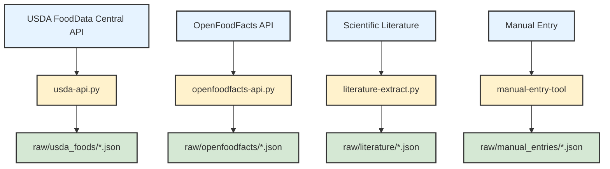
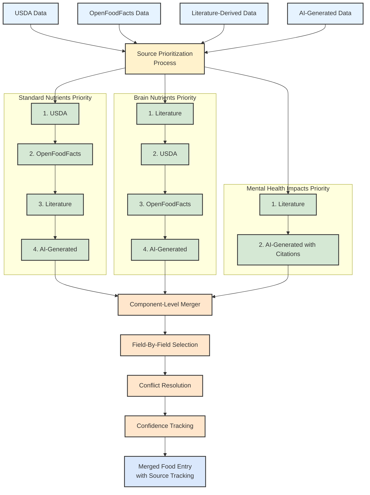

# Nutritional Psychiatry Database: Methodology

This document outlines the comprehensive methodology used to create the Nutritional Psychiatry Database. We aim for full transparency in our approaches to ensure scientific validity and reproducibility.

## Overview

The Nutritional Psychiatry Database combines data from multiple sources using a multi-phase approach:

1. **Foundation Data Collection**: USDA nutritional data as the base
2. **Schema Mapping & Transformation**: Converting to our comprehensive schema
3. **Data Gap Analysis**: Identifying missing brain-specific nutrients
4. **AI-Assisted Enrichment**: Filling gaps with machine learning predictions
5. **Literature-Based Validation**: Cross-checking with scientific research
6. **Expert Review**: Validation by subject matter experts
7. **Quality Scoring**: Assigning confidence ratings to all data points

## Research-Driven Schema Design

Our expanded schema is informed by current nutritional psychiatry research, particularly:

### Dietary Pattern Recognition
Based on Marx et al. (2021), we now track dietary patterns rather than just isolated nutrients. The SMILES trial and similar interventions demonstrate that whole dietary patterns like the Mediterranean diet show stronger associations with mental health outcomes than individual nutrients alone.

### Inflammatory Potential
Research by Firth et al. (2019) highlights the role of inflammation in the diet-mental health relationship. Our inflammatory index provides a simplified approximation of a food's inflammatory potential based on its nutrient profile.

### Neural Pathway Targeting
Recent work on nutritional psychiatry has identified specific neural pathways affected by diet. Our schema now tracks impacts on pathways like BDNF signaling, neuroplasticity, and oxidative stress.

### Contextual & Individual Factors
The field increasingly recognizes that nutrient effects are context-dependent. Our schema now captures:
- Temporal effects (time of day consumption)
- Food combination effects (nutrient synergies)
- Preparation method effects
- Population-specific variations

## Data Sources

## Multi-Source Data Integration Approach with PostgreSQL

Our enhanced methodology integrates multiple authoritative data sources within a PostgreSQL database:

### Database-Driven Data Integration
We now store all food data in a centralized PostgreSQL database with:
- Unique food_id identifiers with source prefixes (usda_, off_, lit_)
- JSON storage for flexible schema evolution
- Indexing for efficient querying
- Transaction support for data integrity

### Source Prioritization Strategy
For each food entry, data is merged from multiple sources using a confidence-based prioritization system stored in the database:
1. **Standard Nutrients**: USDA > OpenFoodFacts > Literature > AI-generated
2. **Brain Nutrients**: Literature > USDA > OpenFoodFacts > AI-generated
3. **Bioactive Compounds**: Literature > OpenFoodFacts > USDA > AI-generated
4. **Mental Health Impacts**: Literature > AI-generated

This hierarchical approach ensures we use the most reliable source for each data component while maintaining all data in a single database record.

### USDA FoodData Central

[USDA FoodData Central](https://fdc.nal.usda.gov/) serves as our primary data source for standard nutritional information. We use their Foundation Foods, SR Legacy, and Survey (FNDDS) databases, accessed via the FoodData Central API.

**Key considerations:**
- We prioritize Foundation Foods data when available
- Standard Release (SR) Legacy data is used as a backup
- We map USDA food categories to our simplified category system

### Scientific Literature

For brain-specific nutrients and mental health impacts not available in USDA data, we draw from:

- Peer-reviewed journal articles
- Systematic reviews and meta-analyses
- Reference databases for less common nutrients
- Brain-specific nutrition textbooks and references

All literature-derived data includes source citations and confidence ratings.

### AI-Assisted Generation

For nutrients and compounds where direct measurements are unavailable, we use AI models (primarily GPT-4) to generate predictions based on:

- Similar foods with known values
- Nutritional science principles
- Typical patterns in food composition
- Known relationships between nutrients

All AI-generated data is clearly marked and includes confidence ratings.

## Detailed Methodology by Component

### 1. Data Collection



We collect:
- Food descriptions and categories
- Serving size information
- All available nutrients (~150 nutrients per food)
- Metadata on analytical methods and sample origins

### 2. Schema Transformation



```python
# Key steps in our transformation script
def transform_usda_to_schema(usda_data):
    # Map USDA nutrient IDs to our schema
    # Organize into our hierarchical structure
    # Convert units for consistency
    # Calculate derived metrics
```

We perform:
- Nutrient mapping from USDA IDs to our schema
- Unit conversions (e.g., IU to μg for vitamins)
- Organization into logical categories
- Derivation of some values (e.g., nutrient ratios)

### 3. Brain Nutrient Enrichment

When brain-specific nutrients are missing, we use a multi-tiered approach:

1. **Literature search**: Find direct measurements in scientific papers
2. **Derivation from proxies**: Calculate from related nutrients when possible
3. **AI-assisted prediction**: Generate estimates based on similar foods

For AI-assisted predictions, we:
- Provide the model with complete nutrient profile
- Include food category and characteristics
- Ask for estimates with confidence levels
- Validate against known values when possible

Example prompt structure:
```
Based on nutritional science, predict the following missing brain-specific nutrients for [food name] (category: [category]).

The food has these standard nutrients (per 100g):
[standard nutrients]

Please predict values for:
- tryptophan_mg
- omega3.epa_mg
- ... [other missing nutrients]

Provide confidence levels and rationale.
```

### 4. Bioactive Compound Enrichment

For bioactive compounds:
1. **Literature-first approach**: Search specific studies measuring compounds
2. **Reference databases**: Use specialty databases for polyphenols, etc.
3. **AI prediction**: For foods with limited direct measurements

Confidence ratings are lower for bioactive compounds due to greater natural variability and fewer standardized measurements.

### 5. Mental Health Impact Attribution

Mental health impacts require the most rigorous approach:

1. **Systematic literature review**: Find clinical and preclinical studies
2. **Mechanistic analysis**: Document known pathways
3. **Evidence grading**: Rate strength based on study quality
4. **Consensus approach**: For conflicting evidence

When using AI to help identify impacts, we:
- Provide all known nutrients and compounds
- Request evidence-based mechanisms
- Require citations for all claimed effects
- Apply stricter validation criteria

### 6. Quality Scoring System

All data points include quality metrics:

1. **Completeness**: Percentage of schema fields with valid data
2. **Source reliability**: Based on source type and quality
   - Direct measurement: 8-10
   - Literature-derived: 6-8
   - AI-predicted with good confidence: 4-6
   - AI-predicted with low confidence: 1-3
3. **Impact confidence**: For mental health impacts
   - Based on study quality, replication, effect size
   - 1-10 scale with clear criteria
   - Requires multiple studies for scores above 7

### 7. Validation Procedures

Our validation process includes:

1. **Cross-reference checking**: Compare multiple sources
2. **Outlier detection**: Flag values outside expected ranges
3. **Consistency verification**: Check related nutrients for consistency
4. **Expert review**: Domain experts review a sample of foods
5. **User feedback**: Mechanism for community corrections

## Limitations and Considerations

We acknowledge several inherent limitations:

1. **Natural variability**: Nutrient content varies by growing conditions, preparation methods, etc.
2. **Missing data**: Some compounds have limited scientific measurement
3. **Emergent research**: Nutritional psychiatry is still evolving
4. **AI limitations**: Predictions are estimates and may contain errors
5. **Individual differences**: People respond differently to foods and nutrients

## Future Methodology Improvements

We plan to enhance our methodology through:

1. **Expanded direct measurements**: Partner with labs for key nutrients
2. **Improved AI models**: Train specialized models on nutritional data
3. **Bayesian confidence**: More sophisticated uncertainty quantification
4. **Personalization factors**: Account for demographic and genetic factors
5. **Temporal dynamics**: Account for nutrient interactions over time

## References

1. USDA FoodData Central. https://fdc.nal.usda.gov/
2. Marx W, et al. Nutritional Psychiatry: The present state of the evidence. Proc Nutr Soc. 2017;76(4):427-436.
3. Jacka FN. Nutritional Psychiatry: Where to next? EBioMedicine. 2017;17:24-29.
4. Sarris J, et al. Nutritional medicine as mainstream in psychiatry. Lancet Psychiatry. 2015;2(3):271-274.

## Appendix: Code Examples

For full transparency, key algorithms are documented in our GitHub repository, including:

- USDA API integration
- Nutrient mapping and transformation
- AI prompting strategies
- Confidence scoring algorithms
- Quality validation checks

---

For questions or suggestions about our methodology, please open an issue on GitHub or contact the project maintainers.
